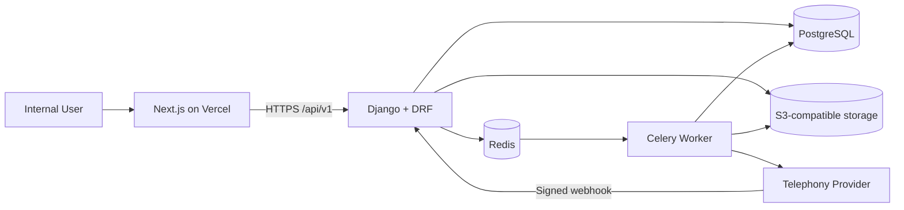
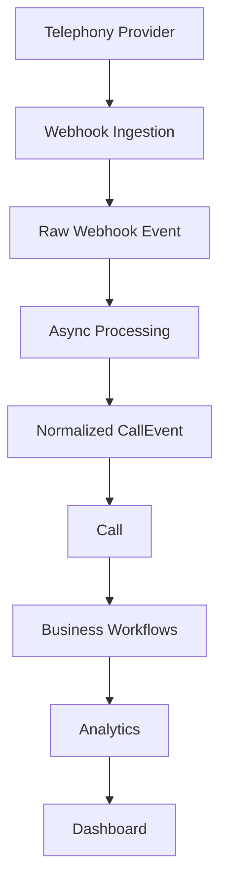

# System Architecture

## Decision

Careergize Pulse is a modular monolith: one Django codebase owns transactional business behavior, while HTTP and Celery processes provide synchronous and asynchronous execution. The Next.js application is a separate presentation deployment. Domain apps communicate through explicit service functions and stable model identifiers, not provider-specific payloads.

## Context and containers

## Backend modules

- `accounts`: user identity and authorization primitives.
- `organizations`: tenant root, membership, and tenant policy.
- `teams`: teams, agent assignment, and internal ownership.
- `contacts`: people and company contact data.
- `calls`: provider-neutral calls and normalized call events.
- `telephony`: adapters, webhook intake, raw events, and normalization.
- `leads`: lead state and qualification.
- `campaigns`: outbound/inbound campaign definitions.
- `followups`: tasks and follow-up lifecycle.
- `analytics`: derived metrics and read models.
- `notifications`: channel-neutral notification requests.
- `integrations`: non-telephony external-system adapters.
- `audit`: immutable security and business audit records.

Cross-cutting code belongs in `common`; it must not accumulate domain behavior. Imports should point inward: provider adapters depend on domain contracts, never the reverse. Cross-domain writes go through application services and transaction boundaries. Celery tasks are thin, idempotent entry points into those services.

## Conceptual processing flow

The raw event is durably stored before acknowledgement/processing. Provider event IDs enforce idempotency. Normalization produces stable internal event types. Failures are retryable and observable; poison messages remain recorded for operator review.

## Frontend

The App Router uses route groups by product area. `features/` owns feature UI, hooks, schemas, and API functions; `components/ui/` contains shadcn primitives; `lib/` contains query client and transport infrastructure. Server Components are the default; Client Components are introduced only for interactive state. TanStack Query owns remote client state, React Hook Form plus Zod owns forms, and Recharts owns charts.

## Key decisions

1. PostgreSQL is authoritative; Redis is disposable infrastructure.
2. API compatibility is protected by `/api/v1` versioning.
3. UUID primary keys avoid enumerable identifiers and ease future data movement.
4. Organization ownership is explicit on business rows; global reference rows are exceptional.
5. Authentication begins with secure Django session cookies for the first-party web client. Token/OIDC support can be added at the boundary later without changing domain ownership.
6. Recordings and exports use a storage interface with local and S3-compatible implementations.
7. No Kubernetes, Kafka, Elasticsearch, event sourcing, AI, or microservices are warranted at this scale.
