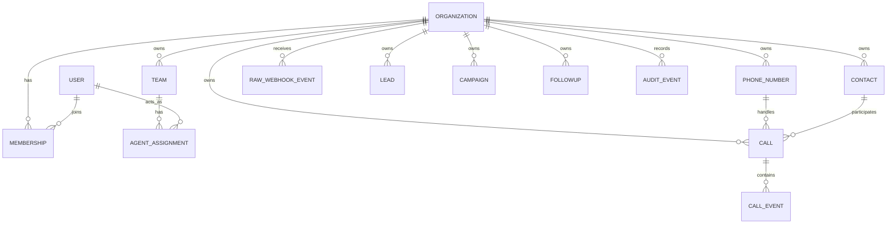

# Database Architecture

PostgreSQL is the system of record. Models use UUID keys, UTC timestamps, explicit foreign keys, and database constraints. Every tenant-owned aggregate includes a non-null `organization_id`; uniqueness is generally scoped to it. Deletion defaults to protection or soft lifecycle state for business/audit data, with retention jobs introduced only when policy is approved.

## Tenant enforcement

The initial safeguard is defense in depth: organization-scoped managers/querysets, service methods requiring an organization context, serializer validation, permission classes, and tests proving cross-organization access fails. Background jobs carry organization IDs explicitly. PostgreSQL row-level security is a possible later hardening layer, not the only isolation mechanism and not enabled prematurely.

## Migration discipline

Each domain owns its migrations. Production changes are backward-compatible in staged deployments: add nullable/additive schema, deploy code, backfill asynchronously, enforce constraints, then remove obsolete schema in a later release. Analytics starts with indexed queries/materialized views where justified; a warehouse is deferred.
