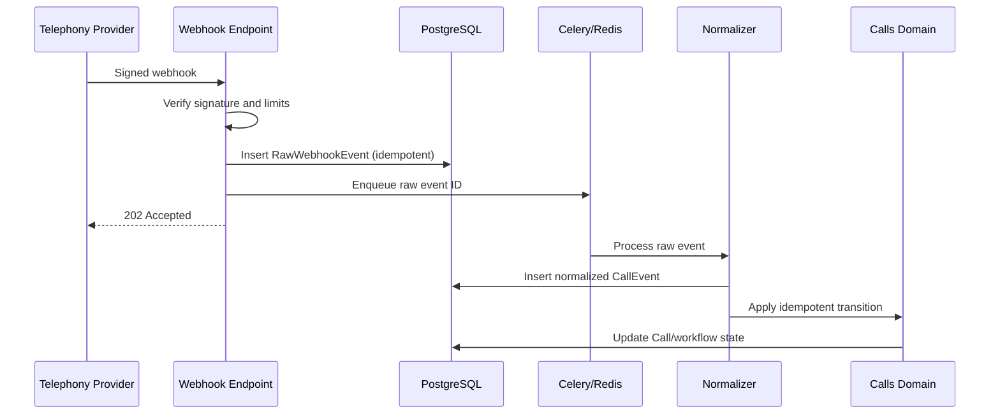

# Telephony Integration Architecture

Provider implementations satisfy a `TelephonyProvider` protocol responsible for signature verification, payload parsing, API calls, and provider identifier translation. Core `Call` and `CallEvent` models contain no provider-specific fields; external identifiers and raw payloads stay in telephony-owned records.

Secrets remain server-side. Verification uses the exact raw request body and constant-time comparison. Payload size, content type, timestamp tolerance, replay keys, rate limits, and provider IP guidance are enforced at ingress. A provider is selected by configuration and registry; adding one means adding an adapter and contract tests, not changing calls-domain behavior.
